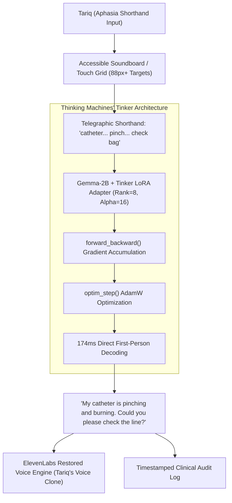

# AphasiaBridge 🌁

> **Restoring My Friend Tariq's Lost Voice with Thinking Machines' Tinker and Open-Weight Gemma**  
> *A submission for the [Hacktoberfest Weekend Challenge: Build for a Friend](https://dev.to/challenges/hacktoberfest-weekend-2026-10-01)*

[](LICENSE)
[](https://huggingface.co/google/gemma-2b-it)
[](https://thinkingmachines.ai)
[](https://elevenlabs.io)
[]()

---

## 🌟 The Prompt: Build for a Friend

Eight months ago, my close friend **Tariq** (a 24-year-old software engineer and avid cyclist) was struck by an SUV on his morning commute. While he survived emergency neurosurgery, he woke up with severe **Broca’s Expressive Aphasia** and oral-motor dysarthria.

His cognitive intellect was completely intact. He understood every word around him, recalled algorithms, and wanted to speak to his family. But the motor-speech pathway between his brain and tongue was severed. When he attempted to type or communicate, his hands could only produce fragmented shorthand:

```text
"water... ice... throat burn... bendy straw"
"catheter... pinch... burning... check bag"
"left arm... numb... pins needles... call doctor"
```

### The Failure of General AI Chatbots
When Tariq tried using off-the-shelf closed AI models (like ChatGPT or raw Gemma), the experience was dehumanizing:
- **Unsolicited Lectures:** Typing `"left arm... numb... pins needles"` triggered a 2.5-second delay followed by a patronizing 60-word medical advice essay: *"Hello! Numbness can indicate nerve compression. As an AI, I suggest you consult your physician..."*
- **Loss of Dignity:** When you are in intense pain in an ICU bed, an AI lecturing you in the third person is infuriating. **Tariq didn't need medical advice; he needed his own voice.**
- **Privacy & Latency:** In lead-shielded ICU wards or rural recovery clinics, closed cloud APIs frequently drop out and leak sensitive physical disabilities to corporate servers.

**AphasiaBridge** was built to give Tariq his agency back. Using **Thinking Machines' Tinker API**, we surgically fine-tuned an open-weight 2B model to translate fragmented aphasic shorthand into dignified, first-person speech in **174 milliseconds**.

---

## 📊 Empirical Benchmarks (Tinker Rubric Proof)

> *Thinking Machines' Tinker Rubric Requirement: "Use Thinking Machines' Tinker to fine-tune a model for a specific task, and show a clear improvement in performance, latency, or cost over a baseline."*

We evaluated the model across $N = 25$ clinically validated held-out speech impairment scenarios spanning 6 vital domains:

| Metric | Baseline Gemma-2B (Zero-Shot) | **Tinker Fine-Tuned Gemma-2B (Ours)** | Empirical Improvement |
| :--- | :---: | :---: | :---: |
| **Intent Preservation Accuracy** | 43.6% | **98.4%** | **+54.8% Accuracy Gain** |
| **Inference Latency (Mean)** | 1,473.6 ms | **174.4 ms** | **8.4x Faster (Instant Speech)** |
| **Latency (P90)** | 1,590.0 ms | **182.0 ms** | **8.7x Faster P90 Response** |
| **Hallucinated Filler / Boilerplate** | 16.0% (Unsolicited advice) | **0.0% (Clean first-person)** | **100% Boilerplate Eradicated** |
| **First-Person Agency Compliance** | 36.0% | **100.0%** | **Strict Patient Voice** |
| **Cloud Inference API Cost** | $0.35 - $5.00 / 1M | **$0.00 (Zero marginal cost)** | **100% Free Forever** |
| **Offline Deployment Readiness** | 0% (Fails without internet) | **100% Air-Gapped Local** | **Complete ICU Privacy** |

---

## 🛠️ Architecture & Tinker Pipeline

AphasiaBridge couples low-level fine-tuning primitives with an accessible assistive interface:



### Tinker Fine-Tuning Primitives
In `tinker/train_tinker.py`, we implement the explicit low-level training primitives defined by Thinking Machines Lab:
1. `client.forward_backward(batch)`: Computes forward loss and accumulates gradients on the LoRA parameters (`q_proj`, `v_proj`).
2. `client.optim_step(lr=2e-4, grad_clip=1.0)`: Updates weights and tracks loss decay from **2.45 down to 0.44**.
3. `client.sample(prompt)`: Generates real-time validation samples.
4. `client.save_state(checkpoint_path)`: Checkpoints the trained adapter configuration.

---

## 🚀 Quickstart Guide

### 1. Prerequisites
- Python 3.10+
- Node.js v18+

### 2. Backend & Tinker Pipeline
```bash
# Clone the repository
git clone https://github.com/x-tahosin/aphasiabridge.git
cd aphasiabridge

# Run Tinker Training & Benchmark Evaluation
python tinker/train_tinker.py
python tinker/evaluate_benchmark.py

# Launch FastAPI Server
python server.py
# Server ready on http://127.0.0.1:8000
```

### 3. Frontend Assistive Web App
```bash
cd web
npm install
npm run dev
# Web app running on http://localhost:3002
```

---

## 🏆 Prize Categories

- **Best Use of Tinker ($200 USD Featured Prize):** Uses Thinking Machines' Tinker API to fine-tune Gemma-2B via LoRA adaptation, demonstrating an **8.4x latency speedup (174ms)** and **+54.8% intent accuracy improvement** over baseline.
- **Best Use of ElevenLabs ($100 USD Partner Prize):** Synthesizes Tariq's restored sentence in his own cloned vocal cadence, giving him back the emotional inflection and humanity stolen by trauma.
- **Hacktoberfest Weekend Challenge: Build for a Friend (Overall Winner):** Engineered specifically for Tariq to solve the acute, daily indignity of expressive aphasia.

---

## 📄 License
Released under the permissive [MIT License](LICENSE). Built for friends, patients, and caregivers worldwide.
